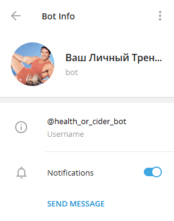
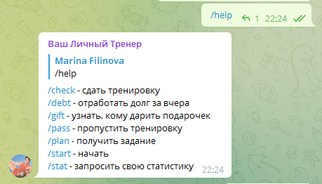
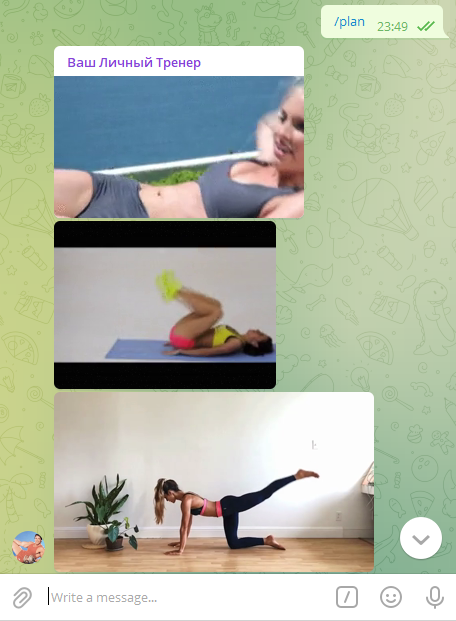
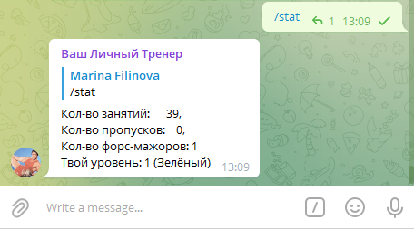

<h1 align="center">Health Bot</h1>

## Description

Health Bot implemented on Python and works with Telegram (username: @health_or_cider_bot). It will help you with training.

## How to use

### Commands:

- **/check** to send your file with training (today)
- **/debt**  to send your file with training (yesterday)
- **/gift**  get the name of a friend in a conversation who needs to give a gift for a pass
- **/pass**  to pass training
- **/plan**  get training plan
- **/start** start talking with bot
- **/stat**  get your personal statistic

/check example:

/help example:

/plan example:

/stat example:

## Future scope

- Add recognize of human body in video and generate recommendation for training
